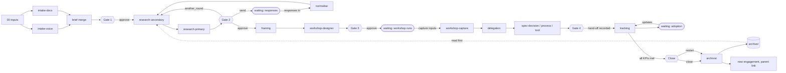

# Loom: architecture as built

`docs/loom-spec.md` is the design. This file records how it was built, and every place
where the build had to decide something the spec left open. Items marked **Check** need
your confirmation.

## Layers

```
.claude/agents/   14 subagents: who does the work (frontmatter: tools, model, skills)
.claude/skills/   12 new skills: how (4 reused skills are referenced, not copied)
schemas/          JSON Schema per artifact + state.json, log.jsonl lines, handoff
engine/loom/      the orchestrator state machine, validators, runners, job queue, CLI
app/              web app on FastAPI: Start, Engagement page, Inbox
infra/            container image + compose: app, worker, volumes, secrets, webhook
engagements/      one folder per engagement (git-ignored except the demo)
archive/          one markdown file per closed engagement (git-ignored)
```

One set of agent files serves both modes:

- **Interactive (phases 0 to 5)**: Claude Code in this folder. `loom run/decide/status`
  drives the engine; or ask Claude to use the `orchestrator` subagent.
- **App (phase 6)**: the worker runs the same agents through the Claude Agent SDK
  (`engine/loom/runners.py`). Each run gets the agent's own system prompt, tool list, model,
  its skills inlined, CLAUDE.md, and a hook that denies any write outside the files the
  orchestrator named for that task. `state.json` and `log.jsonl` are always denied.

## Pipeline



Every gate also accepts **revise** (re-run the stage with notes) and, from gate 2 on,
**reject** back to an earlier stage.

## Stage status cycle

`queued → running → awaiting_gate → done`, plus `waiting_org` for the three long waits.
If an agent fails, or its output does not validate after one retry with the errors fed
back, the stage stops at its gate with `gate.error` set ("blocked"); a blocked gate accepts
only revise or reject. A refused decision (for example approving gate 1 with no research
direction) leaves everything where it is and shows why in `gate.refused`.

## Validation beyond the schemas

The orchestrator also checks the chain that makes Loom traceable:

- every `gap_ref` in questions.md exists in that round's secondary.md;
- every `question_id` in responses.md exists in questions.md;
- every `evidence_refs` entry in problems.md resolves to a real id in a real file;
- the agenda covers every co-creation problem;
- routing covers every workshop action, and each spec's `item_id` matches its routing item.

## Decisions taken during the build

These fill gaps or small contradictions in the spec. **Check** means I'd like your call.

1. **The orchestrator is code, not a model.** The spec calls it "a small state machine
   rather than a clever agent" and also lists `orchestrator.md` with a model. Both exist:
   the engine (`orchestrator.py`) is the real orchestrator in the app and CLI, deterministic
   and free; `orchestrator.md` is for interactive Claude Code and drives the same engine via
   `loom` commands. I gave it **Bash** for that (spec lists Read, Write, Task). **Check.**
2. **Brief merge writes no generated content.** The spec says brief.md is an "orchestrator
   merge" and also that the orchestrator writes no content. The merge is mechanical: it copies
   the intent, sponsor and speakers you entered, lists intake claims and doubts, and keeps any
   edits you already made. `research_direction` is left empty and gate 1 cannot be approved
   until you set it. That makes gate 1's "steer research" a required act. **Check.**
3. **Ids on claims, findings, gaps, questions, answers, problems, decisions, actions.** The
   contract table lists `gap_ref` and `evidence_refs` but not what they point at. I added
   `id` fields (c1, f1, g1, q1, a1, p1, d1, x1) so refs resolve and can be checked. Other
   fields are as drafted; a few optional ones were added (confidence on doc claims and
   findings, `audience_size`, `why`, `due` on specs). **Check** that ids are fine.
4. **Responses are normalised by research-primary.** The spec says responses.md is written
   "by you, pasted or exported". You still can write it directly; if instead you paste or upload
   raw answers, research-primary runs in a normalise mode to key them to question ids. It
   never adds interpretation.
5. **Gate 2 "send" is its own decision.** Send puts the engagement in `waiting_org` until you
   declare responses complete; then the next round starts on its own. "another_round" runs a
   new round straight away with your notes as extra prompts; "approve" means research is done.
6. **Framing has no gate of its own.** Gate 3 sits after framing and workshop design, as in
   the spec's gate table. You can reject from gate 3 back to framing.
7. **The workshop is a wait.** After gate 3 approval the engagement waits for the room. Upload
   wall photos, notes and the transcript and mark them complete; workshop-capture runs.
8. **Gate 4 records the hand-off.** Its "approve" is labelled *Record hand-off* in the app and
   stores owner and meeting date per spec in `state.json.assignments`.
9. **Closing is a fifth decision point, not a fifth gate.** Tracking waits on adoption updates
   and re-runs on each batch. When every item is `met`, a Close panel opens (listed in the
   inbox as gate 5); you can also close early. *Close* runs the archivist; *Restart* also opens
   a new engagement with a `parent` link and your notes as its intent, which is the spec's
   "tracking closes the circle". **Check** that you want the close to be explicit rather
   than automatic.
10. **Spec agents are dispatched by the engine, not by delegation.** In the app, delegation
    writes routing.md and the engine runs one spec agent per item (predictable, logged,
    retryable per item). In interactive Claude Code, delegation keeps its Task tool.
11. **Handoff file names.** Several agents write into the same stage folder, so handoffs are
    `handoff-<agent>.md`, and `<item>.handoff.md` for spec agents.
12. **research-secondary also has Glob** (to list the archive). Only research-secondary has
    web tools; a test enforces that.
13. **Reused skills are referenced, not copied** (your choice). The engine looks in
    `.claude/skills/` then in `LOOM_EXTRA_SKILL_DIRS`. If a reused skill is missing, the
    agent still runs and says so in its handoff. In the cloud you must mount them for
    framing, workshop-designer and research-secondary to work at full strength.
14. **Model aliases** (`sonnet`, `opus`, `haiku`) are kept from the spec; each can be
    overridden per agent with `LOOM_MODEL_<AGENT>` without editing files.

## Still open (from the spec, unchanged)

- **Data rules.** Phases 1 to 5 already send real engagement material through the Anthropic
  API. Confirm PwC's data rules before running a real engagement, not at phase 6.
- **Cloud provider.** `infra/` is provider-neutral containers; see `infra/README.md` for how
  each of the five needs maps to Azure, AWS or GCP.
- **Archive retrieval.** Keyword search over frontmatter now; decide on embeddings at phase 5.
- **Triage tuning.** `loom-problem-triage` is a first cut. Phase 3 says tune it against several
  past engagements before trusting the split.
